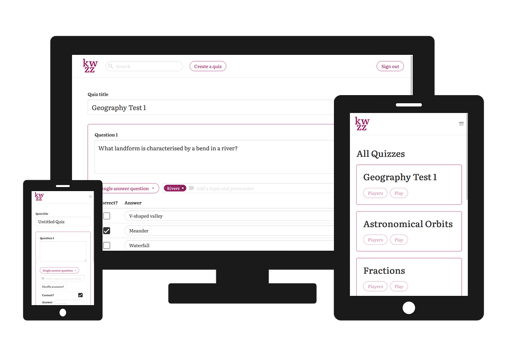

<h1 align="center">

<br>
</h1>

<h4 align="center">A new quiz website built to help people create, share and play quizzes.</h4>

With kwzz, quizzes can be made quickly and easily and shared so that anyone play them and test their knowledge. Once a user has played a quiz, they can easily review their results and recieve feedback on the topics they did poorly on. Creators of quizzes can also review attempts to their quizzes to see how others do at them.

<p align="center">
  
</p>

## Setup

Make sure you have [Node.js](https://nodejs.org/) and [Yarn](https://yarnpkg.com/) installed.

```bash
$ git clone https://github.com/jonathanjameswatson/kwzz.git # or clone your own fork
$ cd kwzz
$ yarn install
```

## Usage

```bash
# To run in development at localhost:3000
$ yarn run dev

# To run in production at localhost:3000
$ yarn run build
$ yarn run deploy
```

## Database setup

Before starting the server, connect to the database and execute the contents of the schema.sql file found in the api/db directory.

## Environment variables

Set the environment variable JWT_SECRET to a secret key before deploying the website in production.

There are five secrets that should be set relating to PostgreSQL database connections. These are:

- DATABASE_URL - PostgreSQL database connection string
- DATABASE_SSL - Boolean of whether or not to connect to the database with SSL

## Website

[Visit the website here](https://kwzz.xyz/)

## License

[MIT](https://choosealicense.com/licenses/mit/)
